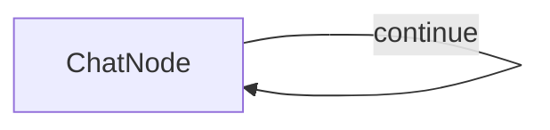

# Pocket-Flow Chat

Простой чат-бот на базе PocketFlow, использующий API OpenRouter.

## Требования

- Python 3.8+
- Установленный пакет pocketflow
- API ключ от OpenRouter

## Установка

1. Установите зависимости:

```bash
pip install pocketflow openai python-dotenv
```

2. Получите API ключ на сайте [OpenRouter](https://openrouter.ai/)

3. Настройте API ключ одним из способов:

   a. Создайте файл `.env` в директории проекта:
   ```
   OPENROUTER_API_KEY=ваш_ключ_api
   ```
   
   b. Или установите переменную окружения:
   ```bash
   export OPENROUTER_API_KEY=ваш_ключ_api
   ```

## Запуск

```bash
python main.py
```

## Использование

- Введите сообщение и нажмите Enter
- Для выхода напишите 'exit'

## Features

- Conversational chat interface in the terminal
- Maintains full conversation history for context
- Simple implementation demonstrating PocketFlow's node and flow concepts

## How It Works

